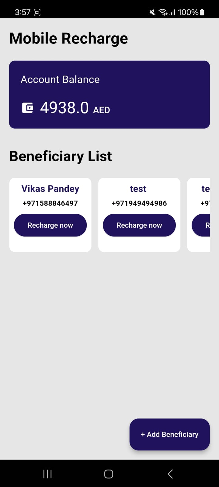
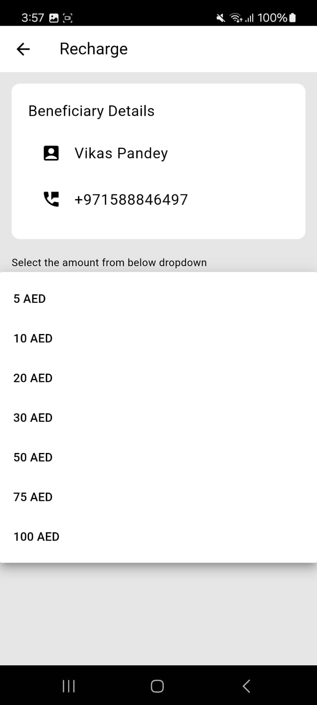
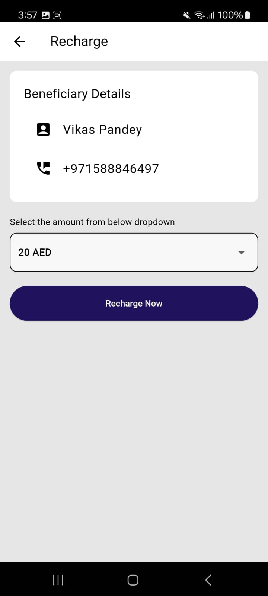
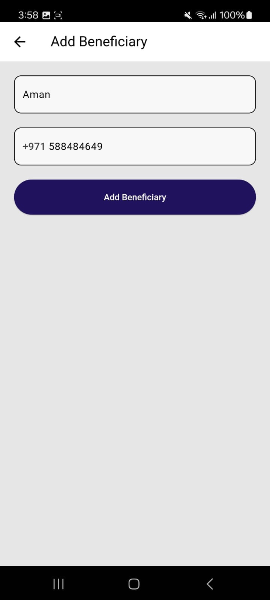

# Mobile Recharge

This repository contains a Flutter-based mobile recharge app. The app allows users to manage and top-up their beneficiaries' mobile balances. The project utilizes local JSON files for mocked data and follows the repository pattern to structure the data layer.

## Features

- Add up to 5 active top-up beneficiaries.
- View and manage top-up beneficiaries.
- Select from various top-up options.
- User verification to manage top-up limits.
- Real-time data mock using local JSON files.

## Architecture

This application uses the Bloc pattern for state management and the Repository pattern to abstract data fetching logic. This ensures a clean separation of concerns and makes the codebase more maintainable and testable. This application utilizes local JSON files for mocked data.

- **Bloc**: Handles the state management of the application. All the business logic is contained within the BLoCs (Business Logic Components).
- **Repository Pattern**: Acts as an intermediary between the data source (API) and the BLoCs, ensuring data fetching logic is abstracted away from the UI components.

## Usage

**Adding Beneficiaries**:
- Users can add beneficiaries by providing a nickname and mobile number.
- The nickname is limited to 20 characters.
  
**Topping Up**:
- Users can top up their beneficiaries with preset amounts.
- There are different limits for verified and unverified users.
- A charge of AED 1 is applied for every top-up transaction.

**Managing Data**:
- Data is stored in a local JSON file (assets/user_mock_data.json).
- The nickname is limited to 20 characters.

## Testing
Unit tests are written using the flutter_test, bloc_test and mocktail packages.

## Approach

**Mock Data**:
The app uses a local JSON file (assets/user_mock_data.json) to mock the backend data. This approach simplifies testing and development by avoiding the need for a real backend service. The data is loaded from the JSON file and can be updated to reflect changes in the app.
  
**Repository Pattern**:
The repository pattern is used to separate the data access layer from the business logic. This pattern provides a clean architecture, making the code more maintainable and testable.
- **UserRepository**: Handles data operations related to the user.
- **BeneficiaryManager**: Manages beneficiary-related operations.
- **TopUpManager**: Handles top-up logic and ensures limits are enforced.

**Cubit State Management**
The app uses the flutter_bloc package to manage state with Cubits. Each feature has its own Cubit to manage the state and business logic.

**Managing Data**:
- Data is stored in a local JSON file (assets/user_mock_data.json).
- The nickname is limited to 20 characters.

## Video representation

[Watch the video](screenshots/Mobile_Recharge.mp4)

## Screenshots

 | 
 | 

### Prerequisites

- Flutter SDK
- Dart SDK
